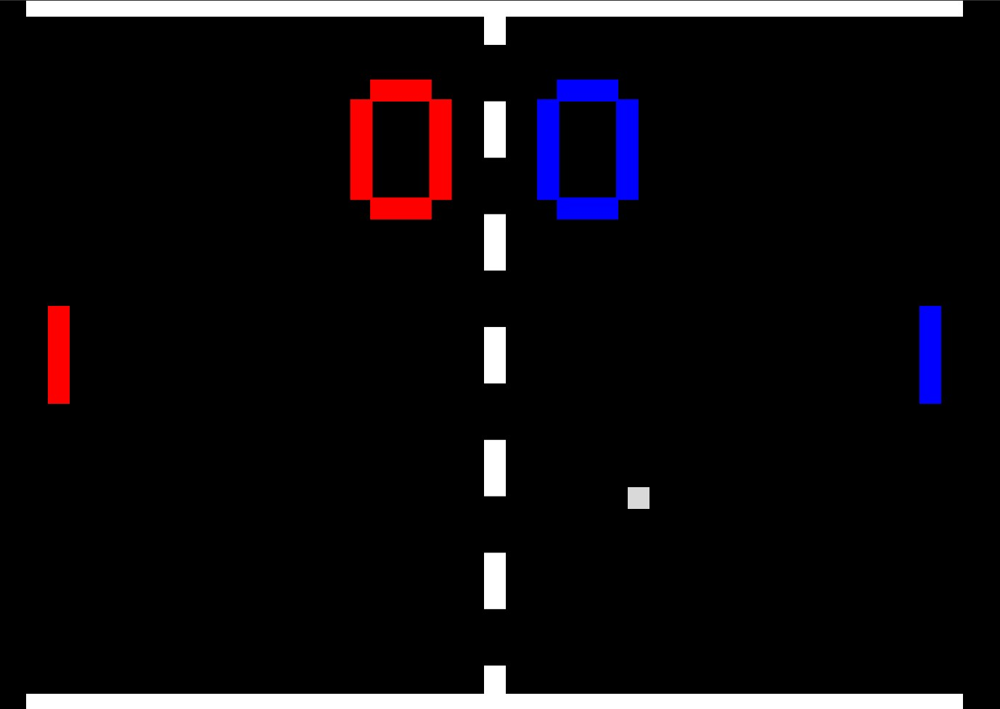

# 🏓 Jeu de Ping Pong (HTML/CSS/JS)

## 🎮 Description

Petit jeu de **Ping Pong** réalisé en **HTML**, **CSS** et **JavaScript**. Le jeu fonctionne comme la version classique : une balle rebondit entre deux raquettes.

---

## ⚙️ Fonctionnalités

* ✅ Physique de balle réaliste avec **angles calculés dynamiquement avec pi**
* ✅ Contrôle fluide du joueur avec clavier
* ✅ Score affiché en temps réel
* ✅ Interface simple en HTML/CSS

---

## 🧠 Détail technique

* L’**angle de rebond** est calculé à l’aide de `Math.PI`, selon la position de la balle sur la raquette au moment de l’impact.
* Cela permet des trajectoires variées, rendant le jeu plus dynamique et moins prévisible.

---

## ⌨️ Contrôles

| Touche | Action                     |
| ------ | -------------------------- |
| `W`    | Monter (joueur 1)          |
| `S`    | Descendre (joueur 1)       |
| `↑`    | Monter (joueur 2)    |
| `↓`    | Descendre (joueur 2) |

---

## 📦 Technologies utilisées

* HTML5
* CSS3
* JavaScript (vanilla, sans librairie externe)

---

## 📁 Installation

Aucune installation nécessaire.

1. Clone ou télécharge le dépôt
2. Ouvre simplement le fichier `index.html` dans un navigateur moderne

---

## 📍 Remarques

* Code simple et commenté pour faciliter la compréhension
* Bon point de départ pour apprendre la manipulation des **collisions**, et les **animations en JS**